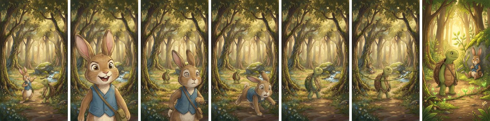
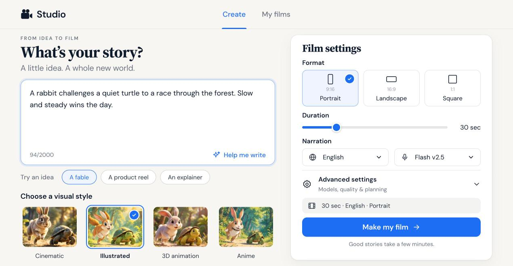
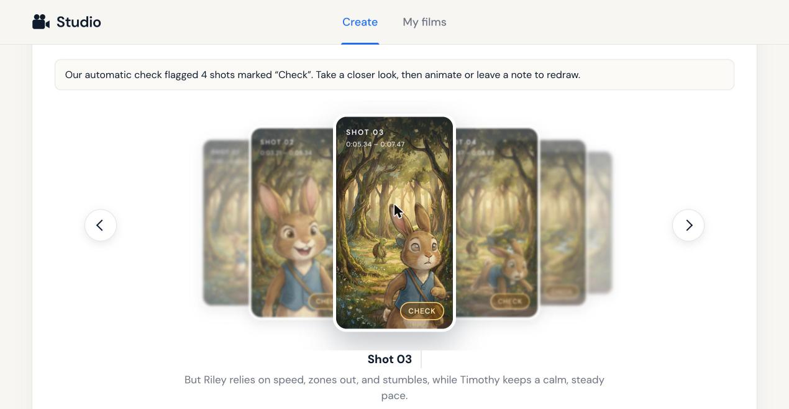
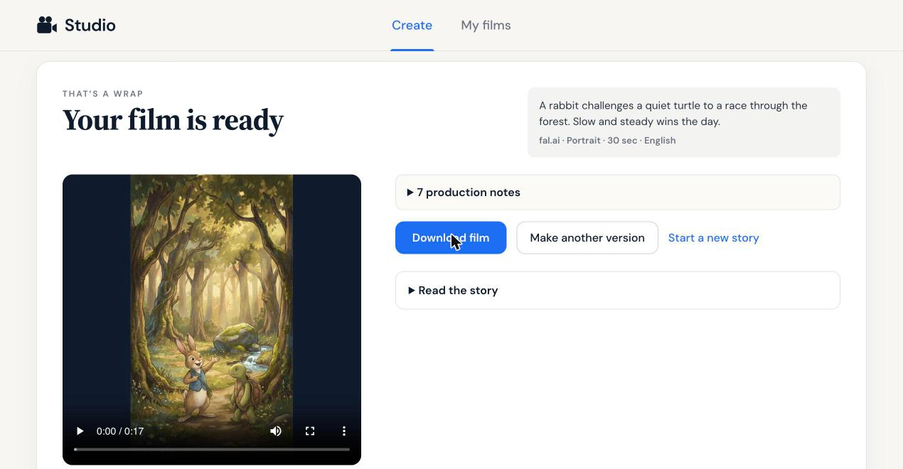
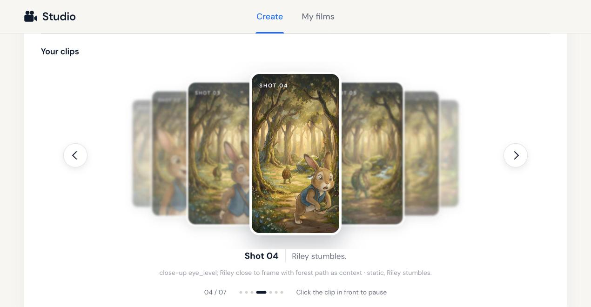
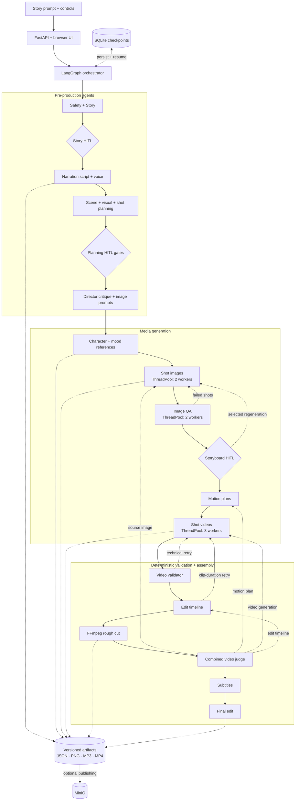
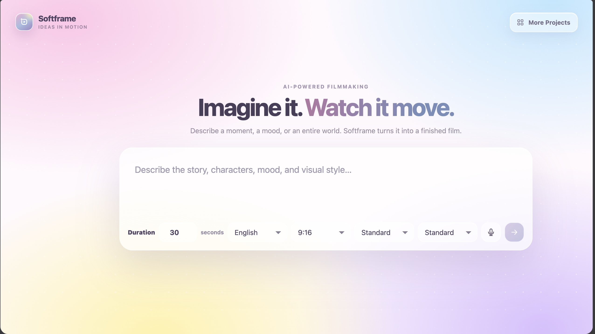

# Magnific Video Automation Agent

**Status: Active Development**

Core pipeline is functional. Current work focuses on improving generation quality, video animation quality, evaluation, retry logic, and production readiness.

A LangGraph pipeline that turns a story prompt into a narrated short video. It plans the story and shots, generates reference art and scene media, validates each stage, assembles a rough cut, and produces the final edit.

## Demo

### Version 1 — narrated storyboard

<p align="center">
  <a href="https://raw.githubusercontent.com/Nehainit/Text_to_video_multi_agent_system/main/demo/robot-story.mp4">
    
  </a>
  <br>
  <a href="https://raw.githubusercontent.com/Nehainit/Text_to_video_multi_agent_system/main/demo/robot-story.mp4"><strong>▶ Watch the 17-second 1080×1920 demo</strong></a>
</p>

### Version 2 — Magnific/Kling animated shots

<p align="center">
  <a href="https://raw.githubusercontent.com/Nehainit/Text_to_video_multi_agent_system/main/demo/version-2-raja-rani.mp4">
    
  </a>
  <br>
  <a href="https://raw.githubusercontent.com/Nehainit/Text_to_video_multi_agent_system/main/demo/version-2-raja-rani.mp4"><strong>▶ Watch the 30-second animated Raja–Rani example</strong></a>
</p>

This run uses three real `kling-v2-6-pro` image-to-video clips with narration and FFmpeg assembly.

### Version 3 — resilient multi-agent pipeline

<p align="center">
  <a href="https://raw.githubusercontent.com/Nehainit/Text_to_video_multi_agent_system/main/demo/version-3-ganesha.mp4">
    
  </a>
  <br>
  <a href="https://raw.githubusercontent.com/Nehainit/Text_to_video_multi_agent_system/main/demo/version-3-ganesha.mp4"><strong>▶ Watch the 25-second validated Ganesha example</strong></a>
</p>

This run demonstrates the complete Version 3 planning, visual QA, narration, timeline, subtitle, and final-edit path. Magnific failed during this run, so the final reel transparently demonstrates the FFmpeg motion fallback rather than AI character animation.

### Version 4 — fal.ai, storyboard review, and clip carousel

<p align="center">
  <a href="demo/version-4-rabbit-turtle.mp4">
    
  </a>
  <br>
  <a href="demo/version-4-rabbit-turtle.mp4"><strong>▶ Watch the 17-second 1080×1920 rabbit-and-turtle film</strong></a>
</p>

Prompt: *"A rabbit challenges a quiet turtle to a race through the forest. Slow and steady wins the day."* — illustrated style, portrait, 30 s requested.

All 7 frames (fal `nano-banana-pro`) and all 7 clips (fal Kling 2.6 Pro) were generated on fal.ai, with Magnific kept as an automatic per-call fallback. The run pauses once for a human: the **storyboard review**, the last cheap step before paid video.

**Storyboard the reviewer approved**

<p align="center"></p>

**Animated clips** (540p previews):
<p align="center">
  <a href="demo/version-4/clips/shot-01.mp4">Shot 1</a> ·
  <a href="demo/version-4/clips/shot-02.mp4">Shot 2</a> ·
  <a href="demo/version-4/clips/shot-03.mp4">Shot 3</a> ·
  <a href="demo/version-4/clips/shot-04.mp4">Shot 4</a> ·
  <a href="demo/version-4/clips/shot-05.mp4">Shot 5</a> ·
  <a href="demo/version-4/clips/shot-06.mp4">Shot 6</a> ·
  <a href="demo/version-4/clips/shot-07.mp4">Shot 7</a>
</p>

**Studio walkthrough**

| 1. Write the idea | 2. Review the storyboard |
|---|---|
|  |  |
| **3. Film ready** | **4. Browse the clips** |
|  |  |

Image QA (`gpt-5-nano`) checks each frame once and shows its findings as **Check** badges; it advises the reviewer instead of silently paying for redraws. Once the storyboard is approved it is final — later stages animate it as-is.

## Pipeline versions

| Version | Video workflow | Status |
|---|---|---|
| **Version 1 — narrated storyboard** | Generates still story images, narration, and an FFmpeg-assembled reel. | Baseline represented by the robot demo above. |
| **Version 2 — animated shots** | Adds per-shot motion plans and Magnific/Kling image-to-video generation, with FFmpeg camera movement as a continuity fallback when animation is unavailable. | [Raja–Rani animated example](demo/version-2-raja-rani.mp4). |
| **Version 3 — resilient multi-agent pipeline** | Adds deterministic validators, visual QA, HITL checkpoints, targeted per-shot retries, concurrent media workers, checkpoint/resume, and MinIO artifact publishing. | [Ganesha fallback example](demo/version-3-ganesha.mp4). |
| **Version 4 — fal.ai + storyboard review** | fal.ai by default with per-call Magnific fallback, a single human storyboard checkpoint in a cover-flow carousel, advisory image QA, and a clip carousel on the finished film. | **Current — Active Development.** [Rabbit–turtle example](demo/version-4-rabbit-turtle.mp4). |

## Engineering snapshot

| **281** automated tests | **24** graph stages | **4** judge retry routes | **2 + 2 + 3** image / QA / video workers |
|---:|---:|---:|---:|
| **3** aspect ratios | **4** LLM providers | **SQLite** checkpoint + resume | **Per-shot** regeneration |

## Cost and time per film

Measured on the Version 4 rabbit–turtle run (7 shots, 1080×1920, fal.ai), from the pipeline's cost ledger:

| Item | Count | Unit price | Cost |
|---|---:|---:|---:|
| Video clips — fal Kling 2.6 Pro | 7 | $0.35 (5 s × $0.07) | **$2.45** |
| Images — fal Nano Banana Pro (7 frames, 2 character sheets, location, mood board) | 11 | $0.15 | **$1.65** |
| Narration — ElevenLabs | 1 | — | $0.014 |
| LLM planning and vision calls — `gpt-5-nano` | 25 | — | $0.011 |
| **Total** | | | **≈ $4.11** |

Kling bills whole 5-second clips, while these shots needed 1.4–3.2 s each, so roughly $1.30 of the video spend is trimmed away in the edit. Planning about one shot per 5 seconds of film would bring the same film to about $2.60.

**Wall-clock time:** about 4 minutes from prompt to storyboard, plus about 6 minutes from approval to the final film (clips render in parallel, ~3 min each) — **~10 minutes of machine time** and one human review.

### Compared with generating the same film by hand

Same 7 clips at 1080p (every platform bills in 5-second blocks, so 35 s of video):

| Route | Pricing model | Video for 7 clips | Hands-on time |
|---|---|---:|---|
| **This pipeline (fal.ai)** | Pay per use, no subscription | $2.45 (+ $1.65 images) | ~10 min machine time, one review |
| Kling (official app) | ~40 credits per 5 s at 1080p; Pro plan ≈ $33/month | ≈ $3.05 | 1.5–3 h |
| Magnific | 45 credits/s for Kling 2.6 at 1080p; plans ≈ $20–34/month | ≈ $1.20–1.60 | 1.5–3 h |
| Higgsfield | ≈ 8–12.5 credits per 5 s; plans $19–129/month | ≈ $2.75–4.30 | 1.5–3 h |

The platform figures cover video only — consistent start frames, narration, subtitles, and editing are extra work or extra tools. Doing it by hand is mostly time: keeping one character consistent across 7 frames, prompting each clip, and cutting voice, subtitles, and clips together typically takes 1.5–3 hours. Platform prices are third-party estimates from September–October 2026 and change often; check each platform's pricing page.

## Architecture



Human review checkpoints and SQLite persistence allow interrupted runs to be reviewed or resumed. Detailed agent contracts are in [`docs/agents`](docs/agents/README.md).

## Interface



## Project structure

```text
video_automation/        Python application package
  agents/                Pipeline agents, judges, validators, and media assembly
  agent_graph.py         LangGraph orchestration
  backend.py             FastAPI entrypoint
  main.py                Interactive CLI entrypoint
  models.py              Model-provider adapters
  prompts.py             Prompt/config loader
  schema.py              Shared state and validation
tests/                   Automated tests
config/                  Prompt and runtime YAML configuration
docs/agents/             Agent contracts
frontend/                Browser UI
assets/                  Bundled reference assets
demo/                    Example generated video
```

## Technology stack

- **Orchestration:** LangGraph with human-review interrupts and SQLite checkpoints
- **API and UI:** FastAPI, Uvicorn, and a dependency-free HTML/CSS/JavaScript frontend
- **LLMs:** with `MODEL_PROVIDER=auto`, each stage tries the chain in `config/models.yml` (OpenAI gpt-5-nano first, then free Groq and Gemini, local Ollama last) and skips providers that are rate limited or have no key. Single-provider modes remain: Ollama, Hugging Face Inference, Gemini, or Groq
- **Media generation:** Choose narration, image, and video models independently from ElevenLabs, Magnific, and fal.ai
- **Media processing:** FFmpeg, ffprobe, and Pillow
- **Storage:** local artifacts with optional MinIO publishing
- **Configuration:** YAML plus environment variables loaded by python-dotenv

## Parallel processing

Speed and film-quality switches live in `config/pipeline.yml`. The pipeline uses Python's standard-library `ThreadPoolExecutor` for the network-bound stages:

- **Planning:** visual beats are derived from the approved scene actions in code (`visual_beats_mode`), and the advisory narration, scene, and director reviewers are off by default. Planning after the story takes three model calls: narration, scenes, and shots.
- **Reference package:** character sheets start in the background as soon as the story is approved, while narration and planning run. Location plates and any remaining sheets render concurrently; the mood board follows.
- **Shot images:** `images.workers` (default 4, overridable with `IMAGE_GENERATION_WORKERS`, clamped to 1–8). With `continuity_reference: scene_anchor`, every later shot in a scene references the scene's first shot, so a scene renders in two parallel waves instead of one shot at a time.
- **Shot-image QA and motion planning:** reviews and per-shot motion plans run concurrently, while preserving approved-shot order for deterministic retries and evaluation records.
- **Shot videos:** `VIDEO_GENERATION_WORKERS` defaults to 5 for fal.ai (cap 5) and 3 for Magnific (cap 4). Logs report upload, provider wait, download, and probe durations per clip.
- **Sound bed:** scene ambience and an instrumental music bed (ElevenLabs) render in the background while shot videos generate.

These are Python threads for overlapping network and model I/O, not CPU-bound multiprocessing.

## Cost control

Set in `config/pipeline.yml` under `budget`:

- **Spending cap:** every paid call (images, videos, narration, routed LLM calls, and priced sound) is recorded in a per-video cost ledger. A call that would pass `max_usd_per_video` is not started. A redo then keeps the current image, a video falls back to free FFmpeg camera motion, and a first-time image that cannot be afforded stops the run with a clear warning. The API response reports `spent_usd`, `budget_usd`, and the full `cost_ledger`.
- **Redo limit:** automatic redos (image QA, video validation, timeline, final judge) are limited per shot (`max_paid_redos_per_shot`, default 1 image and 1 video). Your own regenerate requests are not limited but count toward the budget.
- **Resume instead of resubmit:** fal and Magnific job IDs are saved next to the output file (`*.job.json`). After a timeout the next attempt waits for the same job instead of paying for a new one.
- **No retries of permanent failures:** content-policy, invalid-request (HTTP 400/401/403/404/413/422), and budget errors stop retrying immediately; rate limits, outages, and timeouts are still retried.

## Consistency and finishing

- **One visual style:** the resolved style (default `cinematic storybook illustration`) is used by character sheets, location plates, the mood board, shots, and QA.
- **References per shot:** the character sheets of every character named in the shot, the scene's first shot, and an empty background plate of the location (`images.max_reference_images` per provider).
- **Shot grammar:** about one shot per 5 seconds (`shot_grammar.target_shot_seconds`), distinct actions per shot, and varied framing within a scene.
- **Mix and grade:** ambience and music duck under narration, the whole picture gets one colour grade (`finishing.color_grade`), and the film fades in and out.

## Requirements

- Python 3.10+
- FFmpeg and ffprobe
- Ollama with text and vision models
- Magnific API key when Magnific is selected for image/video generation
- fal.ai API key when fal.ai is selected for image/video generation
- ElevenLabs API key for narration
- MinIO only when externally reachable source media is required

## Setup

```bash
python3 -m venv .venv
source .venv/bin/activate
pip install -r requirements.txt
cp .env.example .env
```

Add your API keys to `.env`, then install the default local models:

```bash
ollama pull qwen2.5:3b-instruct
ollama pull qwen2.5vl:3b
ollama serve
```

When updating an existing checkout, install the new fal.ai client dependency:

```bash
pip install -r requirements.txt
```

## Generation providers

The web composer has separate narration, image, and video model selectors. Options come from `GET /api/model-catalog` and show indicative public API rates with their billing units. Image rates change between Standard (1K) and High (2K) output quality. Magnific video rates are shown in Magnific credits; actual charges depend on the provider's billing plan.

`POST /api/create-video` accepts `narration_model`, `image_model`, and `video_model` IDs from that catalog. The default models are ElevenLabs Flash v2.5, Magnific Nano Banana Pro Flash, and Magnific Kling 2.6. Image and video selections can use different providers in one run. Existing callers can keep sending `image_provider: "magnific"` or `"fal"` to choose both image and video models together. If either new image or video field is present, the other omitted stage uses its default. The CLI still prompts for the legacy combined provider.

To use fal.ai, set its key in `.env`:

```dotenv
FAL_KEY=your_fal_key
```

Fal uses Nano Banana Pro for images and Kling 2.6 Pro for video clips through fal.ai. The key is validated before generation starts. A fal.ai failure does not retry through Magnific; the existing local FFmpeg motion fallback may be used if video generation fails. Fal video uploads source images directly, so it does not need the MinIO public endpoint used by Magnific.

## MinIO and Cloudflare Tunnel

Magnific cannot download an image from `localhost`. The backend therefore uploads each approved storyboard frame to local MinIO, creates a time-limited presigned URL using the public endpoint, and sends that HTTPS URL to Magnific/Kling for image-to-video generation.

```text
Backend → localhost:9000 (upload to MinIO)
Magnific → Cloudflare HTTPS URL → localhost:9000 (download presigned image)
```

Start MinIO's S3 API on port `9000`, then keep this development tunnel running in a separate terminal:

```bash
cloudflared tunnel --url http://localhost:9000
```

Copy the generated `https://...trycloudflare.com` URL into `.env`:

```dotenv
MINIO_ENDPOINT=localhost:9000
MINIO_ACCESS_KEY=minioadmin
MINIO_SECRET_KEY=minioadmin
MINIO_BUCKET=softframe-artifacts
MINIO_SECURE=false
MINIO_REGION=us-east-1
MINIO_PUBLIC_ENDPOINT=https://your-current-tunnel.trycloudflare.com
```

`MINIO_ENDPOINT` is used for trusted local uploads; `MINIO_PUBLIC_ENDPOINT` is used only to sign externally reachable downloads. Tunnel port `9000`, not the MinIO console on `9001`. Quick-tunnel URLs change after restart and are intended for development; use a named tunnel or public object storage for production.

## Run the web app

In a second terminal:

```bash
source .venv/bin/activate
python -m video_automation.backend
```

Open [http://127.0.0.1:8001](http://127.0.0.1:8001), enter a story prompt, and start generation. Artifacts are written under `outputs/<thread-id>/`.

## Run the interactive CLI

```bash
source .venv/bin/activate
python -m video_automation.main
```

The CLI saves progress after each graph step. If a run stops because of an error or you close the terminal, fix the cause and continue the latest run with:

```bash
python -m video_automation.main --resume
```

Use `--resume THREAD_ID` to continue a specific run; the CLI prints its run ID when it starts. A failed step may run again, but completed steps remain in the SQLite checkpoint. Runs started before CLI checkpointing was added cannot be resumed.

## Tests

```bash
.venv/bin/python -m pytest -q
```

The suite currently contains 195 tests.
